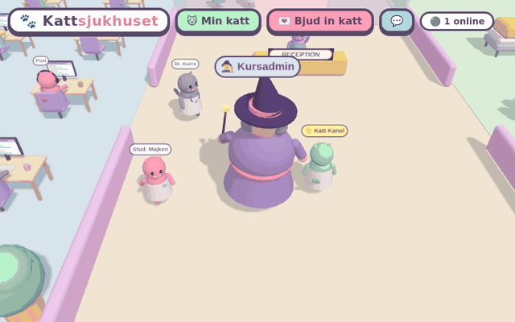
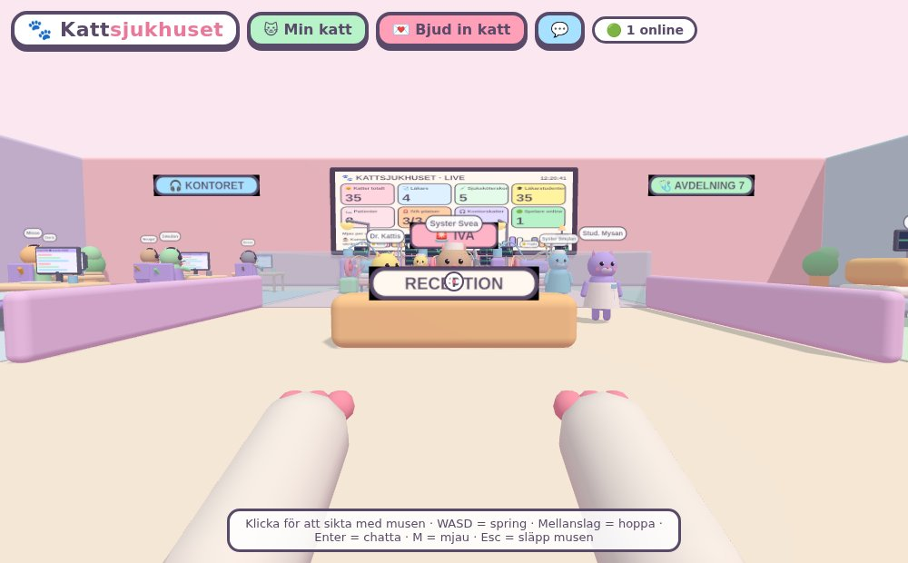
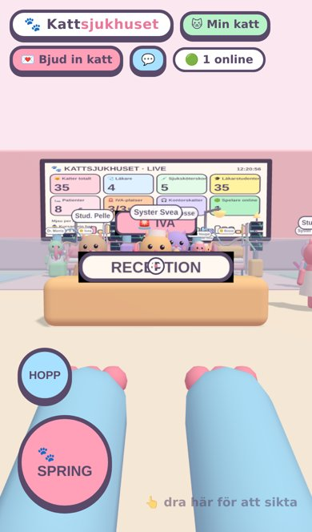

# 🐾 Kattsjukhuset

### Du är en katt. Du är läkarstudent. Kursadmin är ute efter dig.

**[▶ SPELA NU – gigacook.github.io/kattsjukhus](https://gigacook.github.io/kattsjukhus/)**

*Ingen installation. Ingen inloggning. Ingen deadline.\* &nbsp;·&nbsp; \*Kursadmin håller inte med.*

---

## Vad är det här?

Ett gulligt 3D-sjukhus i webbläsaren, med samma känsla som flashspelen du spelade i stället för att plugga. Förstaperson, pastellfärger och katter vars ben ser ut som små korvar.

| | |
|---|---|
| 🎧 **Kontoret** | Katter med headset som svarar i telefon. Ingen vet vad företaget gör. Kön växer ändå. |
| 🩺 **Avdelning 7** | Patienter i sängar med dropp och telemetri. Pulsen ligger på 120. Det är normalt för en katt. Vi har kollat. En gång. |
| 🚨 **IVA** | Tre sängar och fler maskiner än någon kan förklara. Respirator, ECMO, pumpar, varningsljus och en robotlampa. Budgeten för hela regionen, typ. |
| 📊 **Väggskärmarna** | Live-statistik: katter, läkare, sjuksköterskor, patienter och kaffe kvar. Viktigast först, alltså kaffet. |
| 🧙‍♀️ **Kursadmin** | Går runt med trollstav och arga ögonbryn och skriker saker som *"Blanketten ska vara PDF!"*. Katterna hoppar högt, gråter, springer iväg eller svimmar med stjärnor runt huvudet. Precis som i verkligheten. |

&nbsp;

## Bjud in en riktig katt 💌

Tryck **Bjud in katt** och skicka länken. Din vän väljer **namn, färg, storlek och klädsel** (rock, stetoskop, sjuksköterska, headset eller patient) och dyker upp bredvid dig i realtid. Chatten ingår, så ni kan klaga på schemat tillsammans.

> Multiplayer går direkt mellan webbläsarna (WebRTC via PeerJS). Den som skickar länken är värd. Stänger värden fliken är festen slut, ungefär som när kursansvarig går på semester.

## Kontroller

| | Dator | Mobil |
|---|---|---|
| Springa | `W A S D` | Håll in **SPRING** |
| Sikta / titta | Musen (klicka först) | Dra med andra fingret |
| Hoppa | `Mellanslag` | **HOPP** |
| Chatta | `Enter` | 💬 |
| Mjau | `M` | – |

## Teknik

En enda `index.html`. [three.js](https://threejs.org) för 3D, [PeerJS](https://peerjs.com) för multiplayer, inget byggsteg. Den har färre beroenden än din kursplan har revisioner.

Pusha till `main` så publiceras sidan automatiskt.

Ingen katt har tagit skada. Några har tagit 7,5 hp i onödan.

